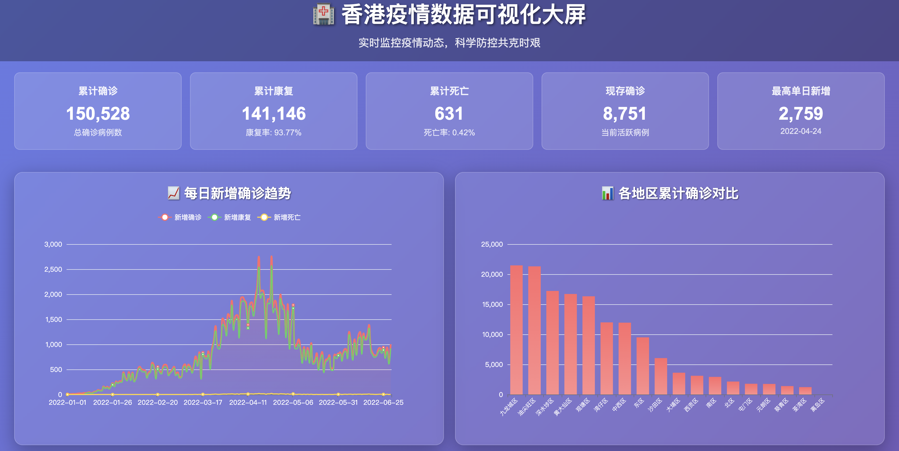
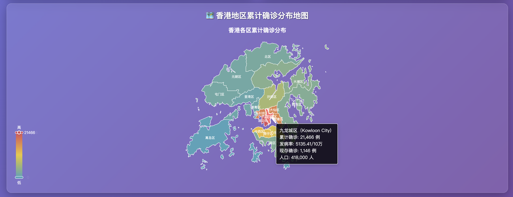

# 香港疫情数据可视化大屏

> **🎯 项目说明**：本项目完全使用 [Cursor](https://cursor.sh/) AI 编程助手生成，展示了 AI 辅助开发在数据可视化领域的强大能力。

## 📊 项目简介

这是一个基于Flask + ECharts的香港疫情数据可视化大屏，实时展示疫情动态和关键指标。项目从需求分析、代码编写、界面设计到部署发布，全程由 Cursor AI 协助完成。

## 📸 项目展示





## 🎯 功能特性

### 📈 5个核心图表
1. **每日新增确诊趋势图** - 折线图展示疫情发展态势
2. **各地区累计确诊对比** - 柱状图对比各区域疫情严重程度
3. **累计确诊增长趋势** - 面积图展示累计数据变化
4. **各地区发病率热力图** - 饼图展示发病率分布
5. **香港地区累计确诊分布地图** - 交互式地图展示各区域疫情分布

### 🎨 界面特色
- 现代化渐变背景设计
- 响应式布局适配不同屏幕
- 实时数据更新（每30秒）
- 毛玻璃效果卡片设计
- 中文界面友好显示

## 🚀 快速开始

### 环境要求
- Python 3.7+
- 虚拟环境（venv）

### 安装依赖
```bash
# 创建虚拟环境
python3 -m venv venv

# 激活虚拟环境
source venv/bin/activate

# 安装依赖包
pip install -r requirements.txt
```

### 启动应用
```bash
# 方法1：使用启动脚本
./start_dashboard.sh

# 方法2：直接运行
source venv/bin/activate
python app.py
```

### 访问大屏
打开浏览器访问：http://localhost:8080

## 📁 项目结构

```
CASE-dashboard_epidemic/
├── app.py                 # Flask主应用
├── read_excel_data.py     # 数据处理脚本
├── start_dashboard.sh     # 启动脚本
├── templates/
│   └── dashboard.html     # 前端模板
├── static/               # 静态资源目录
│   └── geojson/
│       └── hongkong.json  # 香港地图数据
├── venv/                 # 虚拟环境
└── 香港各区疫情数据_20250322.xlsx  # 数据文件
```

## 🔧 API接口

- `GET /` - 主页面
- `GET /api/daily_data` - 每日数据
- `GET /api/region_data` - 各地区数据
- `GET /api/summary_data` - 汇总数据
- `GET /api/map_data` - 地图数据
- `GET /static/geojson/hongkong.json` - 香港地图GeoJSON数据

## 📊 数据说明

数据来源：香港各区疫情数据_20250322.xlsx
- 时间范围：2022年1月1日 - 2022年6月29日
- 数据量：3,240行记录
- 覆盖地区：18个香港行政区

## 🎨 技术栈

- **后端**：Flask (Python)
- **前端**：HTML5 + CSS3 + JavaScript
- **图表库**：ECharts 5.4.3
- **数据处理**：Pandas + OpenPyXL
- **样式**：CSS Grid + Flexbox + 渐变背景

## 📱 响应式设计

- 桌面端：2列网格布局
- 移动端：单列布局
- 自适应图表大小
- 触摸友好的交互设计

## 🔄 数据更新

- 自动刷新：每30秒更新关键指标
- 实时图表：支持动态数据加载
- 错误处理：优雅的错误提示机制

## 🗺️ 地图功能特色

### 交互式地图特性
- **真实地理边界**：使用完整的香港18区真实地理边界数据
- **缩放和平移**：支持鼠标滚轮缩放和拖拽平移
- **悬停提示**：鼠标悬停显示详细疫情信息，格式为"中文（英文）"
- **颜色映射**：根据累计确诊数自动调整区域颜色
- **区域标识**：清晰显示各区名称和真实边界

### 地图数据展示
- **累计确诊数**：各区域累计确诊病例总数
- **发病率**：每10万人口的发病率
- **现存确诊**：当前活跃病例数
- **人口数据**：各区域人口统计
- **中英文对照**：地图区块显示中文地区名，悬停提示显示"中文（英文）"格式

### 视觉设计
- **渐变色彩**：从蓝色到红色的渐变色彩映射
- **高亮效果**：鼠标悬停时区域高亮显示
- **边框样式**：白色边框突出区域边界
- **响应式布局**：地图占据全宽，高度500px
- **真实形状**：使用真实的香港地理边界，不再是简化方块

## 🎯 使用场景

- 疫情监控中心
- 数据展示大屏
- 决策支持系统
- 公众信息发布
- 学术研究分析


### 从 GitHub 克隆项目
```bash
# 克隆仓库
git clone https://github.com/YujunGit/HongKong-covid-visualization.git

# 进入项目目录
cd HongKong-covid-visualization

# 创建虚拟环境
python3 -m venv venv

# 激活虚拟环境
source venv/bin/activate

# 安装依赖
pip install -r requirements.txt

# 启动应用
python app.py
```

## 📞 技术支持

如有问题，请检查：
1. 虚拟环境是否正确激活
2. 依赖包是否完整安装
3. 数据文件是否存在
4. 端口8080是否被占用

---

**注意**：这是一个开发版本，生产环境请使用专业的WSGI服务器。
